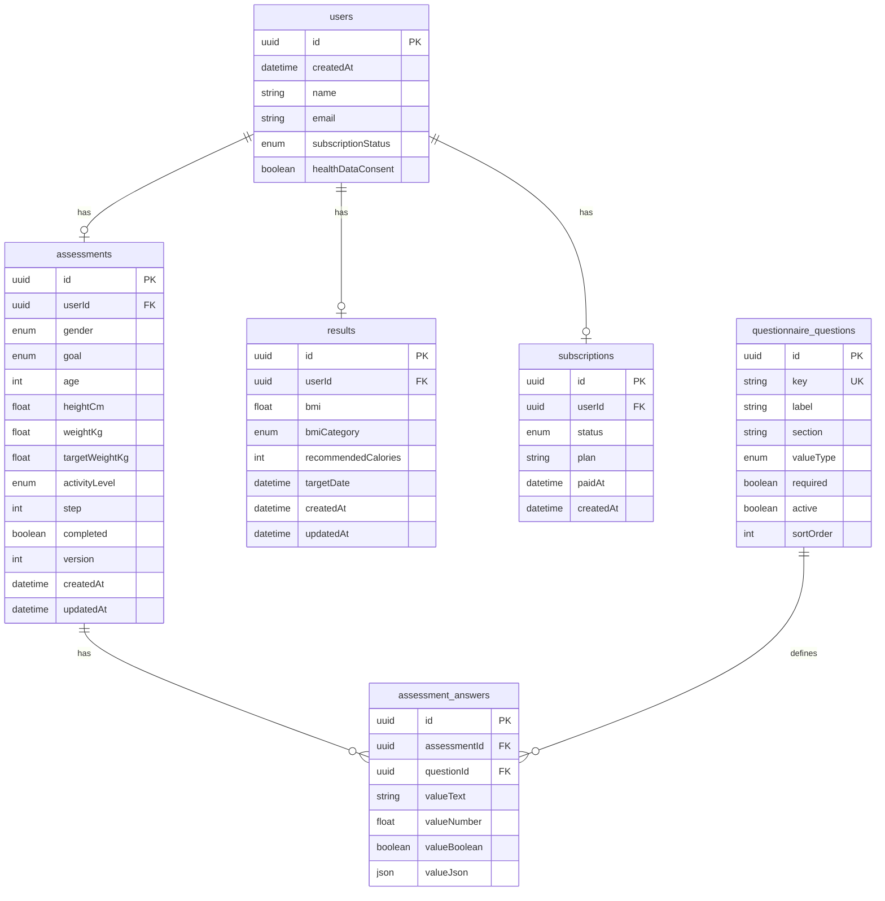

# 健康测评 Funnel 全栈挑战

[](https://github.com/Brandoo110/health-funnel/actions/workflows/ci.yml)

这是一个健康测评 funnel 的全栈实现。重点不是复刻竞品页面，而是把核心后端闭环做完整：分步保存、进度恢复、服务端健康算法、结果持久化、模拟订阅鉴权、非会员脱敏、`/api/pay` 解锁完整结果，以及自动化测试证明关键路径和边界场景正确。

## 一、线上演示

- 线上地址：[https://health-funnel.vercel.app](https://health-funnel.vercel.app)
- GitHub 仓库：[Brandoo110/health-funnel](https://github.com/Brandoo110/health-funnel)
- 已支付测试 `sessionId`：`80e14ffa-dd7d-41fc-8406-d43fc2258e5e`
- 线上 `/api/pay` 验证时间：2026-06-20 22:27 AEST

说明：评审请优先使用上面的稳定 Production 地址。单次 Vercel Preview 地址可能受 Vercel 登录保护影响。

## 二、技术栈

- Next.js 16 App Router
- React 19
- TypeScript
- Prisma 7.8
- Supabase PostgreSQL
- Zod
- Vitest
- GitHub Actions CI

## 三、本地启动

先创建 `.env`：

```bash
DATABASE_URL="postgresql://..."
DIRECT_URL="postgresql://..."
```

然后运行：

```bash
npm ci
npx prisma generate
npx prisma migrate deploy
npm run dev
```

本地访问：

```txt
http://localhost:3000
```

## 四、一键测试与 CI

一键运行测试：

```bash
npm test
```

当前测试结果：

```txt
Test Files  7 passed (7)
Tests       44 passed (44)
```

补充检查：

```bash
npm run lint
npm run build
```

CI 文件位于 `.github/workflows/ci.yml`，在 push / pull request 时自动运行：

- 启动 PostgreSQL service
- `npx prisma generate`
- `npx prisma migrate deploy`
- `npm run lint`
- `npm test`
- `npm run build`

## 五、核心设计说明

### 1. API 设计

接口按资源和业务动作拆分：

- `POST /api/sessions` 创建匿名会话，返回后续全链路使用的 `sessionId`。
- `GET /api/assessment` / `PATCH /api/assessment` 负责测评进度恢复和分步保存。
- `POST /api/assessment/submit` 负责服务端计算并生成结果。
- `GET /api/results` 负责按订阅状态返回免费预览或完整结果。
- `POST /api/pay` 模拟支付成功回调，更新订阅状态。
- `PATCH /api/sessions/lead` 在报告生成后保存姓名和邮箱。

所有入口先做 Zod 校验；`sessionId` 必须是 UUID，格式错误直接返回 `400`，格式正确但不存在返回 `404`。健康数值、enum、扩展问卷答案和 lead 信息都在进入计算或数据库前完成校验，避免非法输入污染后续结果。

### 2. 数据库建模

数据模型采用“核心字段显式列化 + 扩展问卷关系表”的结构：

- `users` 保存匿名 session、lead 信息、健康数据同意状态和订阅状态。
- `assessments` 保存核心健康字段、当前步骤、完成状态和并发版本。
- `questionnaire_questions` 保存可扩展问题定义。
- `assessment_answers` 保存一次测评对扩展问题的答案。
- `results` 保存服务端计算后的结果。
- `subscriptions` 保存模拟订阅快照。

这样做的取舍是：BMI、BMR/TDEE、目标体重和热量建议依赖的字段需要强校验和清晰类型，因此放在 `assessments`；训练偏好、饮食偏好、睡眠压力等后续可能扩展的问题放到问题/答案表，避免把所有问卷内容塞进一张 JSON 大字段，也避免每新增一个问题都改主表。

### 3. 数据持久化逻辑

完整生命周期如下：

1. 创建会话时写入 `users`，前端拿到 `sessionId`。
2. 用户每完成一步，`PATCH /api/assessment` upsert `assessments`，同步保存 `step`、`version`、核心健康字段和扩展问卷答案。
3. 页面刷新或中断后，`GET /api/assessment?sessionId=...` 从数据库恢复已填写数据和当前进度。
4. 提交测评时，`POST /api/assessment/submit` 读取已保存的测评数据，在服务端计算结果，并 upsert 到 `results`，同时把测评标记为 completed。
5. 报告生成后，`PATCH /api/sessions/lead` 把姓名和邮箱补写回 `users`。
6. 支付成功后，`POST /api/pay` 更新 `users.subscriptionStatus`，并 upsert `subscriptions`。
7. 之后同一个 `sessionId` 查询 `GET /api/results`，接口根据数据库里的订阅状态决定返回免费预览还是完整结果。

状态一致性主要靠三个设计保证：同一个 `sessionId` 贯穿测评、结果和订阅；`version` 防止旧页面覆盖新进度；submit 和 pay 都使用 upsert，重复提交不会产生多份冲突数据。

### 4. 模拟订阅闭环

免费用户和已支付用户的区别由后端结果接口控制。免费状态下，`GET /api/results` 不返回精确 `recommendedCalories`、`targetDate` 和完整 `plan`；`POST /api/pay` 后，数据库状态变为 active，同一个 `sessionId` 再次查询结果时才返回完整内容。

这个设计避免只在前端做模糊遮罩。前端负责展示 paywall，后端负责真正的字段权限边界。

### 5. 测试与质量保障

测试覆盖健康算法、分步保存、进度恢复、非法输入、并发版本冲突、非会员/会员差异化返回、`/api/pay` 状态变化和幂等。CI 会在 push / pull request 时自动运行迁移、lint、测试和 build。

## 六、API 文档

所有接收 `sessionId` 的接口都会先校验 UUID。格式错误返回 `400 bad_request`，格式正确但数据库不存在返回 `404 not_found`。

### 1. 创建会话

`POST /api/sessions`

请求：

```json
{}
```

响应：

```json
{
  "sessionId": "uuid",
  "subscriptionStatus": "free"
}
```

### 2. 保存报告后的姓名 / 邮箱

`PATCH /api/sessions/lead`

这个接口只在报告生成后收集 lead 信息，避免一开始就打断用户填写 funnel。

```json
{
  "sessionId": "uuid",
  "name": "Plan Reader",
  "email": "reader@example.com"
}
```

响应：

```json
{
  "ok": true,
  "sessionId": "uuid",
  "name": "Plan Reader",
  "email": "reader@example.com"
}
```

兼容说明：`PATCH /api/sessions` 仍保留为旧路径别名，当前前端使用语义更清楚的 `/api/sessions/lead`。

### 3. 恢复测评进度

`GET /api/assessment?sessionId=...`

空进度响应：

```json
{
  "sessionId": "uuid",
  "healthDataConsent": false,
  "assessment": null,
  "step": 0,
  "completed": false,
  "version": 0
}
```

### 4. 分步保存测评数据

`PATCH /api/assessment`

`version` 可选；传入时用于乐观并发控制，防止旧页面覆盖新数据。

```json
{
  "sessionId": "uuid",
  "step": 3,
  "version": 2,
  "data": {
    "heightCm": 165,
    "weightKg": 72,
    "targetWeightKg": 62
  }
}
```

### 5. 提交测评并生成结果

`POST /api/assessment/submit`

```json
{
  "sessionId": "uuid"
}
```

接口会在服务端计算 BMI、BMI 分类、建议摄入量、目标日期，并把结果写入 `results` 表。

### 6. 查询结果

`GET /api/results?sessionId=...`

非会员只返回安全预览，不返回精确热量、目标日期和完整计划：

```json
{
  "subscriptionStatus": "free",
  "needPaywall": true,
  "result": {
    "bmi": 26.4,
    "bmiCategory": "overweight",
    "recommendedCaloriesRange": "<1500",
    "planPreview": []
  },
  "lockedFields": ["recommendedCalories", "targetDate"],
  "lockedSections": ["weeklyWorkoutPlan", "nutritionPlan", "recoveryPlan", "dailyActions"]
}
```

已支付会员返回完整结果：

```json
{
  "subscriptionStatus": "active",
  "needPaywall": false,
  "result": {
    "bmi": 26.4,
    "bmiCategory": "overweight",
    "recommendedCalories": 1467,
    "targetDate": "2026-09-22T00:00:00.000Z",
    "plan": {
      "summary": {},
      "sections": []
    }
  }
}
```

### 7. 模拟支付回调

`POST /api/pay`

这个接口模拟支付成功后的 webhook / callback。它会把 `users.subscriptionStatus` 更新为 `active`，并 upsert `subscriptions` 表中的订阅记录。

```json
{
  "sessionId": "uuid",
  "plan": "monthly"
}
```

## 七、可重放后端流程

下面这段 cURL 可以从创建 session 一直跑到支付解锁。

```bash
BASE="https://health-funnel.vercel.app"
# 本地调试时可改成：
# BASE="http://localhost:3000"

SESSION_ID=$(curl -sS -X POST "$BASE/api/sessions" \
  -H "content-type: application/json" \
  --data '{}' | node -pe 'JSON.parse(require("fs").readFileSync(0, "utf8")).sessionId')

curl -sS -X PATCH "$BASE/api/assessment" \
  -H "content-type: application/json" \
  --data "{
    \"sessionId\":\"$SESSION_ID\",
    \"step\":10,
    \"data\":{
      \"gender\":\"female\",
      \"goal\":\"lose_weight\",
      \"age\":32,
      \"heightCm\":165,
      \"weightKg\":72,
      \"targetWeightKg\":62,
      \"activityLevel\":\"light\",
      \"pacePreference\":\"standard\",
      \"workoutDaysPerWeek\":4,
      \"sessionMinutes\":30,
      \"workoutLocation\":\"home\",
      \"dietPreference\":\"high_protein\",
      \"sleepHours\":6.5,
      \"stressLevel\":\"medium\",
      \"mainBarrier\":\"no_time\",
      \"healthDataConsent\":true
    }
  }"

curl -sS -X POST "$BASE/api/assessment/submit" \
  -H "content-type: application/json" \
  --data "{\"sessionId\":\"$SESSION_ID\"}"

echo "支付前："
curl -sS "$BASE/api/results?sessionId=$SESSION_ID"

curl -sS -X POST "$BASE/api/pay" \
  -H "content-type: application/json" \
  --data "{\"sessionId\":\"$SESSION_ID\",\"plan\":\"monthly\"}"

echo "支付后："
curl -sS "$BASE/api/results?sessionId=$SESSION_ID"
```

已支付测试 session 可直接查看：

```bash
curl -sS "https://health-funnel.vercel.app/api/results?sessionId=80e14ffa-dd7d-41fc-8406-d43fc2258e5e"
```

## 八、数据库 Schema 图



设计说明：

- `users` 是匿名会话主体，`id` 即前端使用的 `sessionId`。
- `assessments` 保存核心健康字段、进度、完成状态和并发版本。
- `questionnaire_questions` 保存可扩展问卷问题定义，新增非核心问题时不需要继续膨胀 `assessments` 主表。
- `assessment_answers` 保存一次测评对扩展问题的答案；当前训练、饮食、睡眠、压力等计划调参字段都落在这里。
- `results` 保存服务端计算结果，避免每次进入结果页都重新计算。
- `subscriptions` 保存当前模拟订阅快照。
- `users.subscriptionStatus` 是结果查询时的快速鉴权状态。
- 当前只支持公制输入：`heightCm` 和 `weightKg`。
- 建模取舍：核心计算字段显式列化，扩展问卷走问题/答案关系表，避免“一张 JSON 大表”和“主表无限加列”两个极端。

## 九、测试覆盖范围

自动化测试围绕核心风险设计：

- 健康算法：覆盖 BMI、BMR/TDEE、目标体重和热量建议，避免错误计算继续影响结果持久化和订阅展示。
- 分步保存和进度恢复：覆盖中断恢复、刷新、重复点击、乱序提交和并发版本冲突。
- 鉴权差异化和 `/api/pay`：覆盖免费预览、会员完整结果、支付后同一 `sessionId` 的状态变化。
- 数据验证：通过 Zod 拦截非法 enum、越界数字、缺失字段、非法 UUID、数字注入和 `null` 数值。

本地一键运行：

```bash
npm test
```

GitHub Actions 会在 push / pull request 时自动运行迁移、lint、测试和 build。

| 场景 | 覆盖位置 |
|---|---|
| 健康算法单元测试 | `lib/health.test.ts` |
| BMI 分类边界 | `classifies_bmi_boundaries` |
| 极端合法年龄 / 身高 / 体重 | `accepts_min_max_valid_health_inputs` |
| 缺失健康字段 | `rejects_missing_runtime_health_fields` |
| 非法身高 / 体重 / 年龄 / 目标体重 | `rejects_invalid_health_inputs` |
| 不合理目标 BMI | `rejects_unreasonable_target_bmi` |
| 分步保存和进度恢复 | `tests/api/assessment.test.ts` |
| 中断后恢复 | `restores_progress_after_partial_patch` |
| 重复提交 / 同一步重复保存 | `deduplicates_repeated_patch_for_same_step` |
| 乱序更新 | `does_not_regress_step_on_out_of_order_patch` |
| 并发 stale version | `rejects_stale_concurrent_patch` |
| 非法 sessionId 提前拒绝 | `rejects_malformed_session_id_before_database_lookup` 等 |
| 非法数值注入 | `rejects_numeric_injection_and_null_numeric_values` |
| enum / range 校验 | `rejects_invalid_extended_questionnaire_values` |
| submit 缺必填字段 | `rejects_missing_required_health_fields` |
| 结果持久化 | `creates_result_for_complete_assessment` |
| 重复 submit 更新同一份结果 | `updates_existing_result_on_repeat_submit` |
| 未生成结果时访问结果页 | `returns_assessment_not_submitted_before_result_exists` |
| 非会员 vs 会员差异化返回 | `free_result_response_omits_all_protected_keys`、`unlocks_full_result_after_pay_for_same_session` |
| `/api/pay` 状态变化 | `unlocks_full_result_after_pay_for_same_session` |
| `/api/pay` 幂等 | `keeps_pay_idempotent_for_active_session` |
| 报告后保存姓名 / 邮箱 | `tests/api/sessions.test.ts` |
| lead 路径语义 | `persists_lead_contact_through_semantic_lead_alias` |
| 非法邮箱 | `rejects_invalid_lead_email` |
| 首次访问不显示重新开始入口 | `lib/landing-state.test.ts` |
| 120 分钟以上训练时长 | `accepts_long_session_minutes_for_two_hour_plus_training` |
| 长训练时长进入计划生成 | `lib/plan.test.ts` |
| 付费折扣规则 | `lib/pricing.test.ts` |

暂未覆盖：

- 完整浏览器 E2E 暂未纳入 `npm test`。当前页面流程用 Playwright CLI 做本地 smoke，仓库自动化测试优先覆盖后端闭环和接口边界。
- 真实支付 provider 未覆盖。当前实现的是模拟订阅回调，只提供 `/api/pay` 闭环，不接真实 Stripe。
- Vercel serverless 压测暂未覆盖。当前只对关键 `/api/pay` 线上链路做人工可重放验证。
- 真实登录、rate limit、退款和订单事件流暂未覆盖。原因是当前产品采用匿名 session 和模拟订阅，先把 API、DB、持久化、鉴权差异化和测试闭环做好。

## 十、AI 使用复盘

AI 复盘没有直接塞进 README，单独整理在仓库文件：[AI使用复盘.md](./AI使用复盘.md)。

复盘里包含：

- 如何用 AI 读取并分析 BetterMe 竞品数据流
- 如何基于竞品做设计取舍
- 如何用 AI 辅助数据库建模、Mock 数据、健康算法、计划生成和测试用例设计
- 如何设计测试矩阵，并说明覆盖范围和暂未覆盖原因
- 哪些方案被人工判断后否决或修正，以及原因
