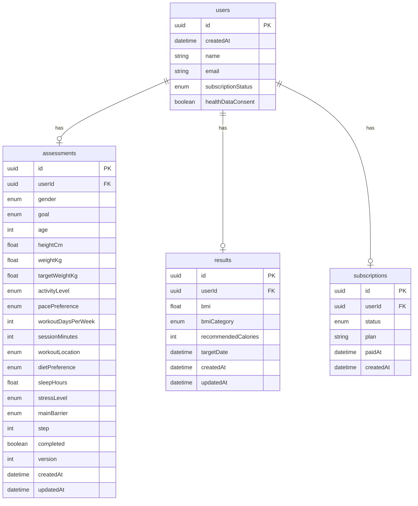

# Health Funnel Challenge

[](https://github.com/Brandoo110/health-funnel/actions/workflows/ci.yml)

健康测评 funnel，全栈实现重点在后端工程骨架：分步保存、进度恢复、服务端健康算法、结果持久化、模拟订阅鉴权、非会员脱敏、`/api/pay` 解锁完整结果，以及自动化测试证明关键流程正确。

## Links

- GitHub: [Brandoo110/health-funnel](https://github.com/Brandoo110/health-funnel)
- Production: [https://health-funnel.vercel.app](https://health-funnel.vercel.app)
- Paid test sessionId: `80e14ffa-dd7d-41fc-8406-d43fc2258e5e`
- Production `/api/pay` verification: 2026-06-20 22:27 AEST

> Use the stable production alias above for review. Individual Vercel deployment URLs may be protected by Vercel authentication.

## Stack

- Next.js 16 App Router
- TypeScript
- Prisma 7.8
- Supabase PostgreSQL
- Zod
- Vitest
- GitHub Actions CI with PostgreSQL service

## Run Locally

Create `.env`:

```bash
DATABASE_URL="postgresql://..."
DIRECT_URL="postgresql://..."
```

Install and run:

```bash
npm ci
npx prisma generate
npx prisma migrate deploy
npm run dev
```

Open:

```txt
http://localhost:3000
```

## Test

One command:

```bash
npm test
```

Current local result:

```txt
Test Files  4 passed (4)
Tests       33 passed (33)
```

Additional checks:

```bash
npm run lint
npm run build
```

CI:

- `.github/workflows/ci.yml`
- Runs on push / pull request.
- Starts a local PostgreSQL service.
- Runs `npx prisma generate`, `npx prisma migrate deploy`, `npm run lint`, `npm test`, and `npm run build`.

## API

### `POST /api/sessions`

Create an anonymous session.

Request:

```json
{}
```

Response:

```json
{
  "sessionId": "uuid",
  "subscriptionStatus": "free"
}
```

### `PATCH /api/sessions`

Persist lead contact after the report has been generated. This keeps name/email out of the early funnel and saves them only when the user reaches the report gate.

```json
{
  "sessionId": "uuid",
  "name": "Junjie Li",
  "email": "junjie@example.com"
}
```

Response:

```json
{
  "ok": true,
  "sessionId": "uuid",
  "name": "Junjie Li",
  "email": "junjie@example.com"
}
```

### `GET /api/assessment?sessionId=...`

Restore saved progress.

Response when empty:

```json
{
  "sessionId": "uuid",
  "healthDataConsent": false,
  "assessment": null,
  "step": 0,
  "completed": false,
  "version": 0
}
```

### `PATCH /api/assessment`

Incrementally save one step. `version` is optional; when present it enables optimistic concurrency.

```json
{
  "sessionId": "uuid",
  "step": 3,
  "version": 2,
  "data": {
    "heightCm": 165,
    "weightKg": 72,
    "targetWeightKg": 62
  }
}
```

### `POST /api/assessment/submit`

Submit the completed assessment and persist calculated results.

```json
{
  "sessionId": "uuid"
}
```

### `GET /api/results?sessionId=...`

Returns different payloads by `subscriptionStatus`.

Free users get a safe preview:

```json
{
  "subscriptionStatus": "free",
  "needPaywall": true,
  "result": {
    "bmi": 26.4,
    "bmiCategory": "overweight",
    "recommendedCaloriesRange": "<1500",
    "planPreview": []
  },
  "lockedFields": ["recommendedCalories", "targetDate"],
  "lockedSections": ["weeklyWorkoutPlan", "nutritionPlan", "recoveryPlan", "dailyActions"]
}
```

Paid users get full results:

```json
{
  "subscriptionStatus": "active",
  "needPaywall": false,
  "result": {
    "bmi": 26.4,
    "bmiCategory": "overweight",
    "recommendedCalories": 1467,
    "targetDate": "2026-09-22T00:00:00.000Z",
    "plan": {
      "summary": {},
      "sections": []
    }
  }
}
```

### `POST /api/pay`

Simulated payment callback. It sets `users.subscriptionStatus=active` and upserts the active subscription record.

```json
{
  "sessionId": "uuid",
  "plan": "monthly"
}
```

## Replay Full Backend Flow

```bash
BASE="http://localhost:3000"
# Or replay against production:
# BASE="https://health-funnel.vercel.app"

SESSION_ID=$(curl -sS -X POST "$BASE/api/sessions" \
  -H "content-type: application/json" \
  --data '{}' | node -pe 'JSON.parse(require("fs").readFileSync(0, "utf8")).sessionId')

curl -sS -X PATCH "$BASE/api/assessment" \
  -H "content-type: application/json" \
  --data "{
    \"sessionId\":\"$SESSION_ID\",
    \"step\":10,
    \"data\":{
      \"gender\":\"female\",
      \"goal\":\"lose_weight\",
      \"age\":32,
      \"heightCm\":165,
      \"weightKg\":72,
      \"targetWeightKg\":62,
      \"activityLevel\":\"light\",
      \"pacePreference\":\"standard\",
      \"workoutDaysPerWeek\":4,
      \"sessionMinutes\":30,
      \"workoutLocation\":\"home\",
      \"dietPreference\":\"high_protein\",
      \"sleepHours\":6.5,
      \"stressLevel\":\"medium\",
      \"mainBarrier\":\"no_time\",
      \"healthDataConsent\":true
    }
  }"

curl -sS -X POST "$BASE/api/assessment/submit" \
  -H "content-type: application/json" \
  --data "{\"sessionId\":\"$SESSION_ID\"}"

curl -sS "$BASE/api/results?sessionId=$SESSION_ID"

curl -sS -X POST "$BASE/api/pay" \
  -H "content-type: application/json" \
  --data "{\"sessionId\":\"$SESSION_ID\",\"plan\":\"monthly\"}"

curl -sS "$BASE/api/results?sessionId=$SESSION_ID"
```

The paid test session can be inspected directly:

```bash
curl -sS "https://health-funnel.vercel.app/api/results?sessionId=80e14ffa-dd7d-41fc-8406-d43fc2258e5e"
```

## Database Schema



Design notes:

- `assessments` stores mutable step-by-step input.
- `results` stores server-calculated output.
- `subscriptions` stores the current simulated subscription snapshot.
- `users.subscriptionStatus` is a quick authorization snapshot for result reads.
- Only metric input is supported: `heightCm` and `weightKg`.

## Test Coverage

The tests target the scoring rubric directly: data validation, persistence recovery, state consistency, server-side calculation, authorization boundaries, and `/api/pay` state transition. These are the paths where a health funnel backend can silently fail even when the UI looks fine.

| Requirement | Covered by |
|---|---|
| Health algorithm unit tests | `lib/health.test.ts` |
| BMI boundaries | `classifies_bmi_boundaries` |
| Extreme legal age / height / weight | `accepts_min_max_valid_health_inputs` |
| Missing health fields | `rejects_missing_runtime_health_fields` |
| Invalid height / weight / age / target weight | `rejects_invalid_health_inputs` |
| Unreasonable target BMI | `rejects_unreasonable_target_bmi` |
| Step save and progress restore | `tests/api/assessment.test.ts` |
| Interrupted resume | `restores_progress_after_partial_patch` |
| Repeated submit / same step | `deduplicates_repeated_patch_for_same_step` |
| Out-of-order patches | `does_not_regress_step_on_out_of_order_patch` |
| Concurrent stale version | `rejects_stale_concurrent_patch` |
| Illegal numeric injection | `rejects_numeric_injection_and_null_numeric_values` |
| Enum / range validation | `rejects_invalid_extended_questionnaire_values` |
| Missing required fields on submit | `rejects_missing_required_health_fields` |
| Persist result | `creates_result_for_complete_assessment` |
| Repeat submit updates same result | `updates_existing_result_on_repeat_submit` |
| Results before submit | `returns_assessment_not_submitted_before_result_exists` |
| Free vs paid response | `free_result_response_omits_all_protected_keys`, `unlocks_full_result_after_pay_for_same_session` |
| Non-member protected fields absent | explicit `not.toHaveProperty` assertions |
| `/api/pay` state change | `unlocks_full_result_after_pay_for_same_session` |
| `/api/pay` idempotency | `keeps_pay_idempotent_for_active_session` |
| Unknown pay session | `returns_404_for_unknown_pay_session` |
| Post-generation lead capture | `tests/api/sessions.test.ts` |
| Invalid lead email | `rejects_invalid_lead_email` |

## Not Covered Yet

- Full browser e2e is not part of `npm test`; it was validated with Playwright CLI smoke locally.
- Real payment provider behavior is not covered because `/api/pay` is intentionally a simulated callback.
- Load / concurrency stress testing against Vercel serverless is not covered; the key `/api/pay` flow was verified once on production.

## AI Collaboration Notes

AI was used as an implementation partner, not as an unchecked code generator:

- Competitive research: inspected the BetterMe funnel network/localStorage flow to understand session creation, step progress, answer payloads, and paywall behavior before designing tables.
- Database modeling: drafted the four-table model around `users`, `assessments`, `results`, and `subscriptions`, then refined it to keep mutable inputs separate from calculated results.
- Mock and test data: generated deterministic questionnaire payloads for valid users, incomplete users, stale clients, numeric injection attempts, and paid/free sessions.
- Core logic: implemented BMI, BMR/TDEE, calorie recommendation, target-date calculation, and plan generation as server-side pure functions plus API integration.
- Test generation: used AI to enumerate boundary cases, then turned the original Phase 4 requirement into Vitest unit/integration tests.

Rejected / corrected AI example:

- The first implementation did not explicitly re-check the original Phase 4 text; it had good tests, but the README/CI and a few named boundary cases were still under-documented. After re-reading the task file, I added missing runtime-field tests, numeric-injection tests, CI, and a coverage matrix.
- Another review found `measureSystem` was stored but not actually supported. I removed it instead of pretending imperial units were implemented.
- The original calorie preview range was too narrow and could be reverse-engineered; it was widened into fixed buckets for safer non-member responses.
